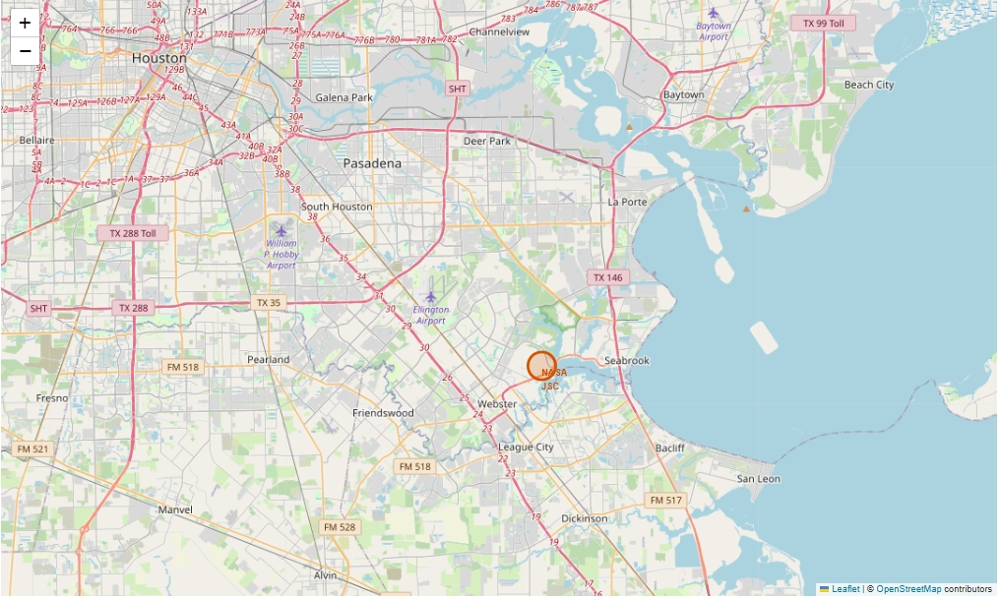
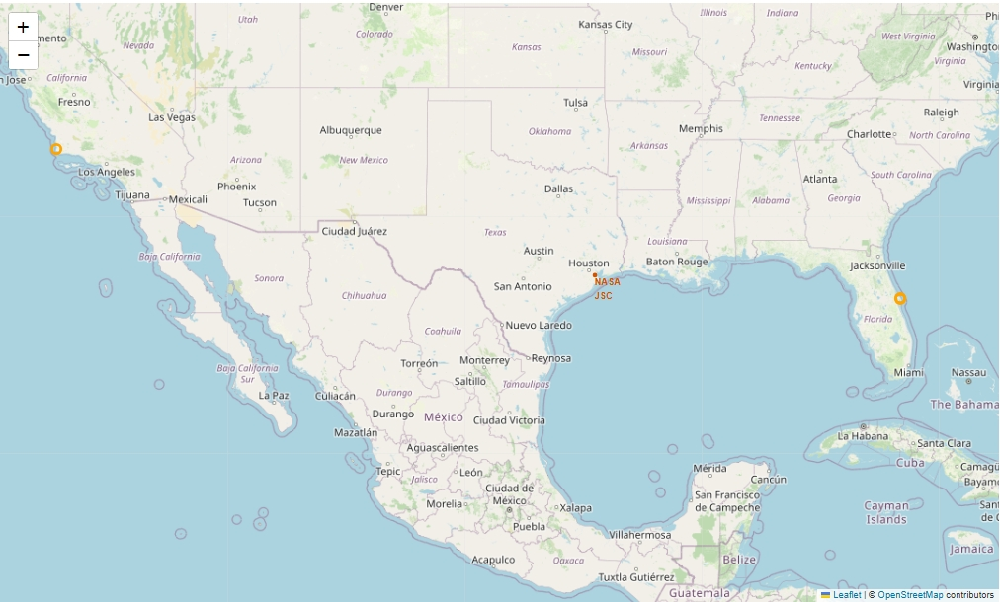
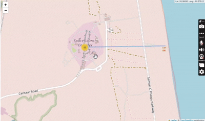
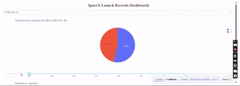

### SpaceX Launch and Booster Landing Predictions built with:  
- **Python** for backend logic and data processing  
- **Pandas** & **NumPy** for efficient data handling  
- **Matplotlib** & **Seaborn** for visualization  
- **Scikit-Learn** for machine learning (Logistic Regression, SVM, Decision Trees, KNN)  
- **Folium** for interactive map plotting  
- **Dash** & **Plotly** for dynamic dashboard visualization  
- **BeautifulSoup** for Web Scraping SpaceX launch details  
- **Requests** & **REST API** for retrieving SpaceX rocket and launchpad data  

---

# SpaceX Launch Data Analysis Using Machine Learning & API/Web Scraping  

This project integrates **REST API** calls and **Web Scraping** techniques to collect SpaceX launch data. After data collection, machine learning models predict **booster landing success rates**, while visualizations offer insights into **launch sites, flight outcomes, and payload influences**.  

## Key Features:  
- Web Scraping SpaceX Launch Data → Extracting historical launch details from Wikipedia  
- REST API Calls for SpaceX Rockets & Launchpads → Fetching metadata and location details dynamically  
- Machine Learning for Booster Landing Predictions → Evaluating logistic regression, SVM, decision trees, and KNN classifiers  
- Geospatial Mapping of Launch Sites → Using Folium to analyze location-based influences on success  
- Interactive Dashboards → Displaying launch success rates, payload distributions, and landing site comparisons  

---

## Visualization 

- SpaceX Launch Sites Mapped with Folium
  





 

  

- Booster Landing Success Rates Per Orbit Type
- Confusion Matrix for the Best Classifier (Decision Tree)
- Interactive Dashboard for Launch Success Analysis

---

## Dependencies 

```bash
pip install pandas numpy matplotlib seaborn scikit-learn folium dash plotly requests beautifulsoup4
```

---

## License 

This project is licensed under the MIT License.
