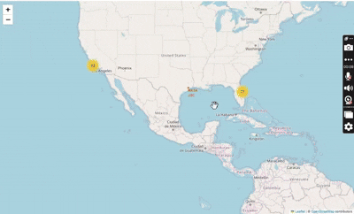

# Predict-Falcon9-Landing
This project aims to predict the success of Falcon 9 first stage landings using machine learning models.

## 🔍 Objective
Using historical launch data, we explore and preprocess the dataset to train models capable of predicting whether a SpaceX Falcon 9 booster will successfully land.

## 📁 Project Structure
- `SpaceX.ipynb` — Main notebook containing EDA, feature engineering, and model development.
- `data/` — Folder to store raw and processed datasets (to be added).
- `README.md` — Project documentation.

## 📊 Workflow So Far
- Retrieved SpaceX Falcon 9 launch data.
- Performed Exploratory Data Analysis (EDA) to understand launch trends and success factors.
- Extracted and engineered relevant features like payload, orbit, launch site, booster version, etc.
- Visualized key relationships using seaborn and plotly.
- Applied encoding techniques to prepare the dataset for machine learning.
- Started building classification models to predict landing success.

## Plots

## 🔧 Tools & Libraries
- Python
- Pandas, NumPy
- Matplotlib, Seaborn, Plotly
- Scikit-learn

## 🚧 Next Steps
- Feature scaling and normalization
- Model training using Logistic Regression, SVM, Decision Trees, etc.
- Hyperparameter tuning and cross-validation
- Model evaluation using accuracy, precision, recall, and confusion matrix

